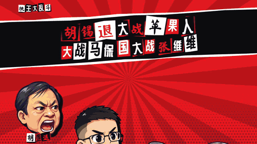

# 梗王大乱斗 · MEME KINGS SMASH

中文互联网梗王的平台格斗游戏：陈平、张维为、胡锡进、峰哥、户晨风、马保国、牢A，七个人同台乱斗，谁被打出屏幕谁就寄。

> 纯属恶搞的同人作品。所有人物都是公众人物的网络梗形象，招式和台词取自公开报道中的言论与网友二创，用于讽刺与娱乐，不代表对任何人的事实陈述。

▶ **在线游玩：<https://weikezhang.cn/ChengPing-VS-ZhangWeiWei/>**（电脑、手机横屏都能玩）

## 🎬 胡锡退大战苹果人大战马保国大战张维维

▶ [完整 30 秒视频（有声）](docs/media/trailer.mp4) · [在浏览器里直接播放](https://weikezhang.cn/ChengPing-VS-ZhangWeiWei/docs/media/trailer.mp4)

四个 Lv8 电脑在「这就是中国」演播室混战：马保国的闪电五连鞭、老胡加仓引发的全场跌停、苹果人的“穷!愤怒!没见识!”、张维维一招“这就是中国”三杀，最后马保国大意了，没有闪。整段是游戏引擎逐帧实录，画面和声音都没有后期剪辑。

## 玩法

大乱斗式规则：伤害 % 越高，被打飞得越远；飞出屏幕外就少一条命，命数用完出局。

- **斩杀线**：每个角色的血条上都标着自己的斩杀线（按体重和舞台算出）。超过这个 % 再挨一记重击就会被斩杀——血条会变红，击杀时有专门的斩杀特写。牢A的蓄力技和终极技专门斩杀线内的对手。
- **热搜「爆」**：场上不定时飘来一个「爆」字，谁打爆谁就能放终极技。
- **快递箱**：打爆开箱，效果归打爆的人——回血、一键三连无敌、流量加持、大V认证变大、被限流变小，或者直接拿到板砖 / 大瓜 / 键盘。
- **弹幕**：观众全程刷弹幕，击杀、连段、格挡、开箱都会引发刷屏，设置里可调密度。

## 操作

| | 键盘 1P | 键盘 2P | 手柄 |
|---|---|---|---|
| 移动（双击冲刺） | A D | ← → | 左摇杆 |
| 跳（空中再按二段跳） | K | 小键盘2 / `.` | X / Y |
| 攻击（W/S/A/D+J 强攻） | J | 小键盘1 / `,` | A |
| 必杀（W/S/A/D+L 四种） | L | 小键盘3 / `/` | B |
| 蓄力重击（按住蓄力） | I | 小键盘5 / `'` | 右摇杆 |
| 防御（+方向 翻滚 / 闪避） | 空格 | 小键盘0 / 右Shift | RT / LT |
| 抓取（再按方向投掷） | U | 小键盘4 / `;` | RB / LB |
| 下蹲 / 快落 / 双击下穿平台 | S | ↓ | 下 |
| 嘲讽 · 暂停 | O · Esc | 小键盘6 · Backspace | Back · Start |

手机上左半屏是虚拟摇杆，右半屏是攻击 / 必杀 / 跳 / 防御 / 抓 / 蓄力六个键。

完整的平台格斗系统都在：短跳、快落、空中闪避、翻滚、完美格挡、抓边与抓边无敌、受身（落地或撞墙瞬间按防御）、方向影响击飞角度（DI）、同招重复使用伤害衰减、护盾破碎晕眩、投技、反击技、反射与吸收飞行道具。

## 模式

- **大乱斗**：最多 4 人（键盘 2 人 + 手柄即插即用 + 电脑），可调命数、限时、道具、舞台机关。
- **流量之路**：单人闯关，从热搜第 7 打到第 1，最后一战 1 打 3。
- **训练有素**：木桩行为可选，显示判定框、连段伤害、出招帧数。
- **梗百科**：每个人物的梗到底从哪来，附出招表。

## 角色

| 角色 | 定位 | 通常 / 侧 / 上 / 下必杀 · 终极技 |
|---|---|---|
| 陈平 | 远程压制 | ¥2000>$3000 / 回旋镖 / 水深火热 / 德州大停电 · 陈平不等式 |
| 张维为 | 反击型 | 中国震撼 / 走访一百多个国家 / 中国超越 / 你要自信 · 这就是中国 |
| 胡锡进 | 重量级陷阱 | 胡编体 / 和稀泥 / 股神在此 / 叼盘 · 反向指标 |
| 峰哥 | 贴身猛攻，会爬墙 | 精神分析 / 亡命天涯·采访 / 冲击珠峰 / 这是好事儿啊 · 弗洛伊峰像 |
| 户晨风 | 轻量游击 | 你用什么手机? / 购买力测试 / 账号转世 / 苹果车 · 安卓逻辑 |
| 马保国 | 反击投技 | 闪电鞭 / 来骗!来偷袭! / 左正蹬·右鞭腿 / 接化发 · 闪电五连鞭 |
| 牢A | 终结斩杀 | 斩杀线 / 扔下筷子就跑 / 跑路回国 / 长生种·短生种 · 美国斩杀线 |

舞台：这就是中国·演播室、浑元擂台、A股交易大厅（K线平台随大盘涨跌，会熔断）、西雅图冰雨夜（冻雨结冰打滑）、德州·美国新家（定时拉闸停电）、山姆会员店（购物车冲出来）。

## 技术

- 纯前端，无构建步骤：`index.html` + `src/` 下的 ES 模块，Canvas 2D 渲染，固定 60Hz 逻辑帧。
- `src/sim/` 是确定性的战斗模拟（状态机、击飞公式、判定、道具、AI），不依赖 DOM，可以在 Node 里无界面跑：`node tools/sim_test.mjs 20 7` 让电脑互打统计平衡数据。
- 角色身体是代码绘制的骨骼动画，头像是 AI 按公开照片生成的 Q 版表情图（牢A本人从未公开长相，游戏中的形象为原创并全程打码）；舞台背景为 AI 生成。
- 音效和配乐全部由 WebAudio 实时合成，没有音频文件；语音播报用浏览器自带的中文朗读。
- 本地运行：`python3 tools/devserver.py 8123`，打开 <http://localhost:8123>。

### 素材流水线

- `tools/gen_art.py`：调用 Codex CLI 生成头像表情表和舞台背景（`art/`）。
- `tools/build_art.py heads|stages`：抠绿幕、切图、打包到 `assets/`。
- `tools/subset_fonts.py`：把字体裁成游戏实际用到的字（改了文案后要重新跑一次）。
- `tools/gallery.html?c=all`：逐帧预览所有角色的所有招式和判定框。
- 录制预告片：用 `tools/devserver.py` 打开 `/?trailer=1&fixed=1280x720`，在控制台运行 `await __recordTrailer()`，逐帧导出画面并离线渲染音轨，再用 ffmpeg 合成（编排在 `src/ui/trailer.js`）。

## 字体与致谢

- [得意黑 Smiley Sans](https://github.com/atelier-anchor/smiley-sans)、[站酷庆科黄油体](https://fonts.google.com/specimen/ZCOOL+QingKe+HuangYou)、[站酷小薇体](https://fonts.google.com/specimen/ZCOOL+XiaoWei)、[马善政毛笔楷书](https://fonts.google.com/specimen/Ma+Shan+Zheng)，均为 SIL Open Font License。
- 界面风格致敬《女神异闻录5》，玩法致敬《任天堂明星大乱斗》。
